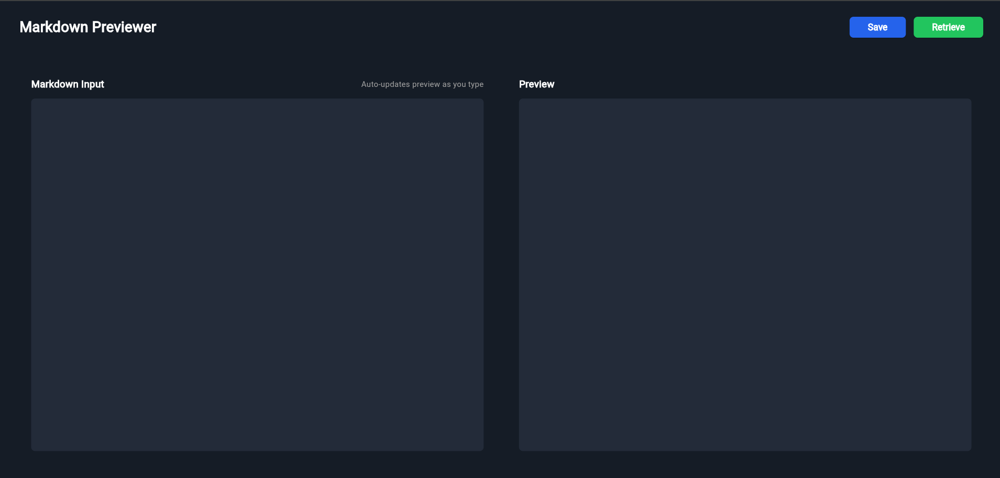
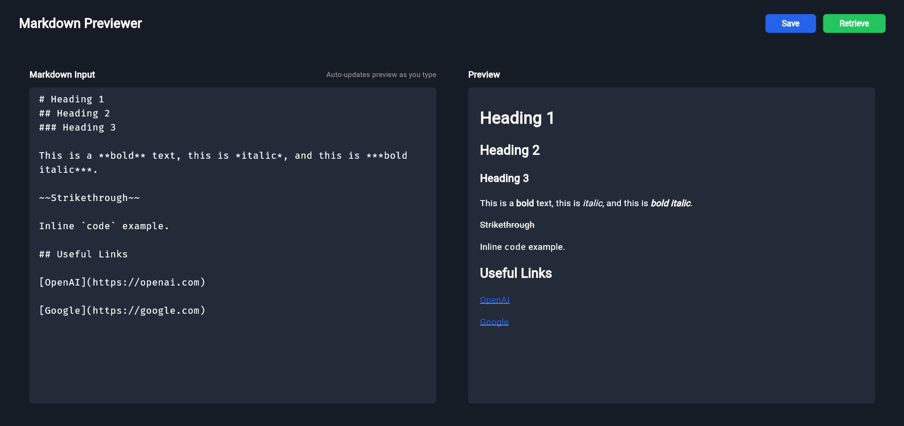
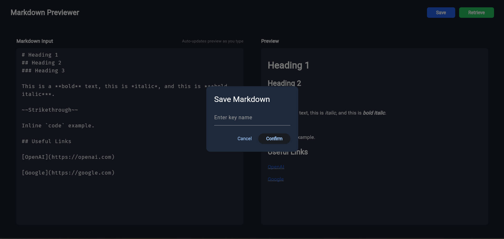

# 📝 Markdown Previewer

A modern Markdown Previewer built with **Flutter** and a **Node.js + MongoDB** backend.

Write Markdown, view a live HTML preview, and persist your notes using unique keys.


## 🎥Demo Video

[](https://drive.google.com/file/d/1DMAHiYoVgPxg9sJm4WroupMCO8RJocsC/view?usp=sharing)

## 📸 Screenshots

<div align="center">
  
</div>

<div align="center">
  
</div>

<div align="center">
  
</div>


## 🚀 Features

- ✍ **Live Markdown Editing**
- 👀 **Real-time HTML Preview**
- 💾 **Save Markdown with Custom Key**
- 🔎 **Retrieve Notes by Key**
- 🌙 **Dark Themed UI**
- 🔗 **Clickable Links**
- 📊 **Table Rendering Support**
- ☁ **MongoDB Atlas Storage**

---

## 🧱 Tech Stack

### **Frontend**
- Flutter (Dart)
- flutter_html
- flutter_html_table
- HTTP package

### **Backend**
- Node.js
- Express.js
- MongoDB Atlas

---


## 🔌 Backend API

| Method | Endpoint | Description |
|--------|----------|-------------|
| POST | `/render` | Convert Markdown → HTML |
| POST | `/save` | Save Markdown with key |
| GET | `/note/:key` | Retrieve Markdown by key |

---

## ⚙️ Environment Variables (Backend)

Create a `.env` file:

```env
MONGO_URI=your_mongodb_atlas_uri
PORT=8000